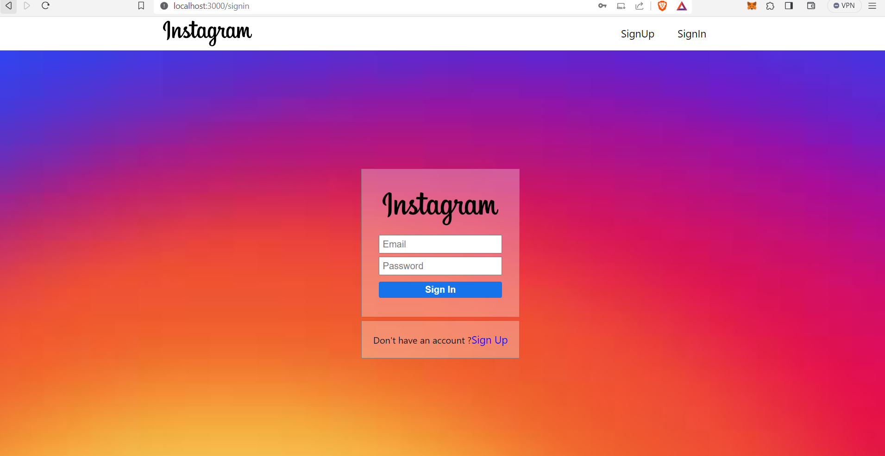
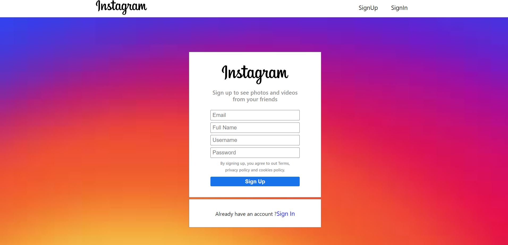
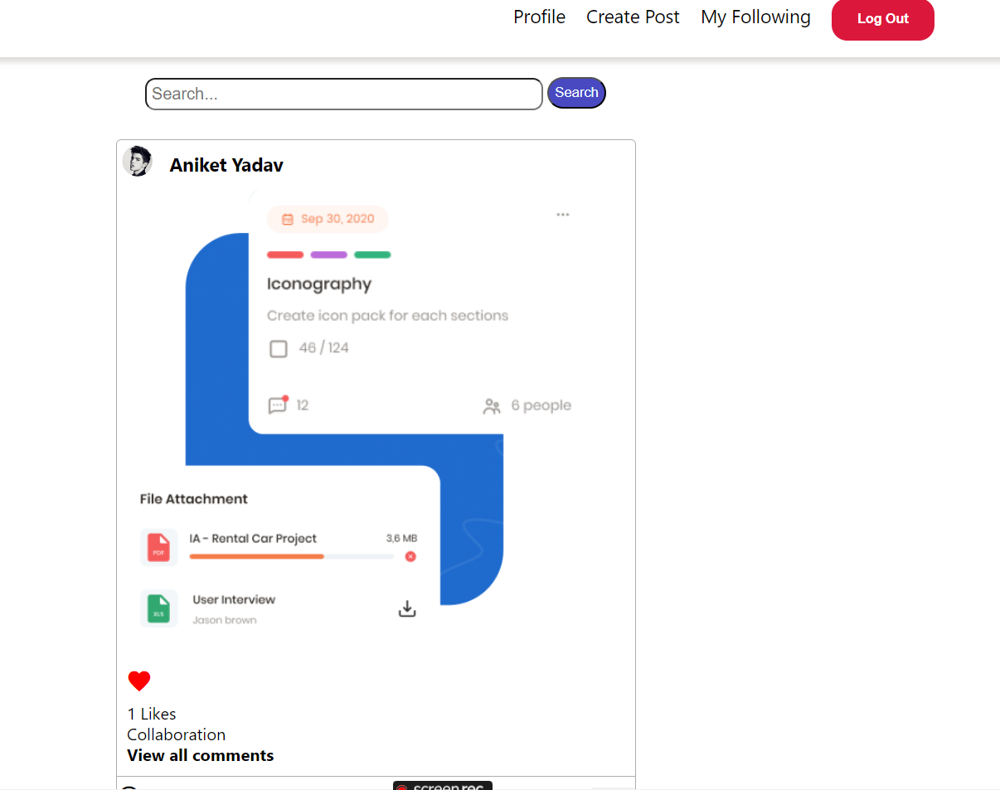
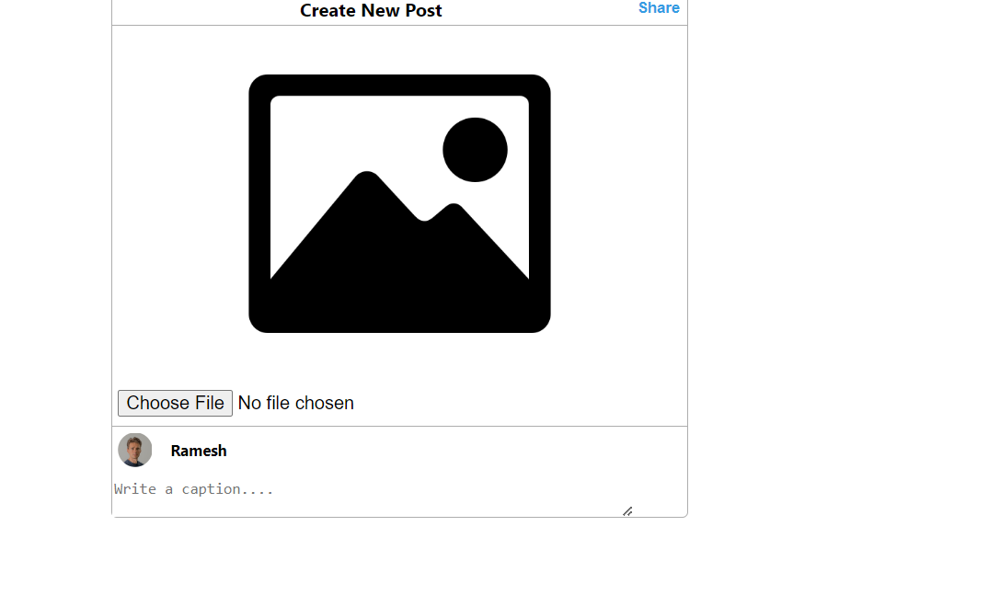
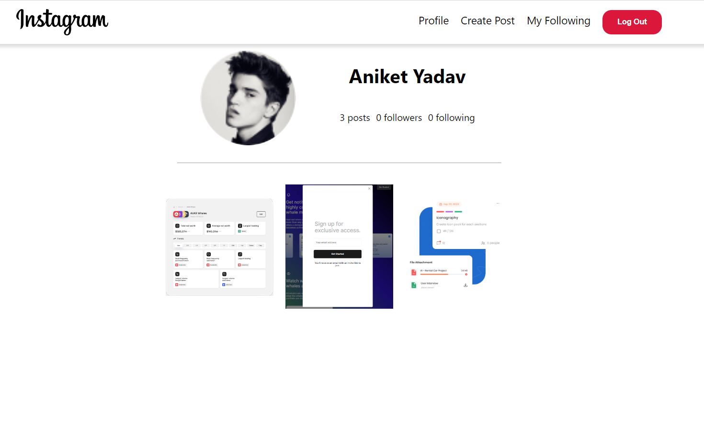
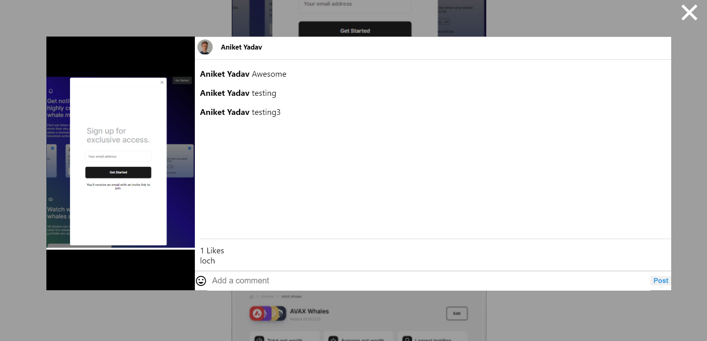

# Steps

-> Go to frontend folder and backend folder and install the dependencies(npm i)

-> Once installed go to backend directory and write a command (node app.js)

-> Once server starts go to frontend directory and write a command (npm start)

-> Once done, then make your accounts and test.

# Insta Full stack 

Video Link: https://youtu.be/MoOHOuuIm8k

# Snippets 

